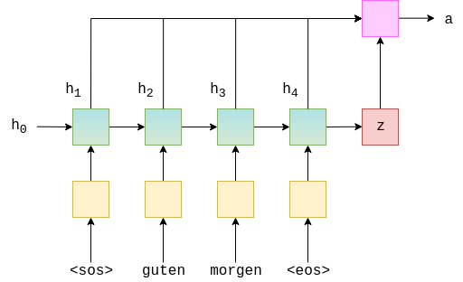
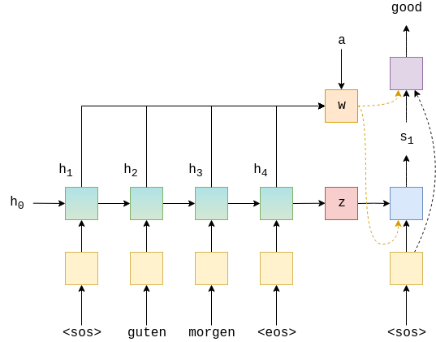

# Seq2Seq with Attention

## Notebook: [attention.ipynb](../notebooks/attention.ipynb)

## Introduction
Attention is a mechanism that forces the model to learn to focus (=to attend) on a specific part of the input sequence when decoding each output time step.

## Changes
- Added Attention layer to the model.
- Encoder is almost the same (except now it's 
bidirectional).

## Attention Architecture
 <br>
Image above taken from [here](https://raw.githubusercontent.com/bentrevett/pytorch-seq2seq/49df8404d938a6edbf729876405558cc2c2b3013//assets/seq2seq9.png).

## Decoder Architecture
 <br>
Image above taken from [here](https://raw.githubusercontent.com/bentrevett/pytorch-seq2seq/49df8404d938a6edbf729876405558cc2c2b3013//assets/seq2seq10.png).


## Limitations
- Model trains very slow.
* **Decreases Long range dependencies issues.**

## Results
- Notebooks that illustrates this architecture and results can be found [here](../notebooks/attention.ipynb).
- Model was trained for 15 epochs.
- Sequence length is 12.
- Trained model can be found [here](../models/attention.pt).

**Good Predictions** <br>
```
toxic_sent: it's gonna kill me.
neutral_sent: it will destroy me.
prediction: it's killing me.

toxic_sent: i'm gonna fucking die.
neutral_sent: i'm bloody dying in there.
prediction: i'm dying.

toxic_sent: that's where i fucked up? huh?
neutral_sent: what i screwed up?
prediction: that's where i screwed up?

toxic_sent: shit! give me 10 minutes?
neutral_sent: can i have 10 minutes?
prediction: give me ten minutes?
```
**Bad Predictions** <br>
```
toxic_sent: so you're gonna make me miserable.
neutral_sent: so you want to make me unhappy.
prediction: so you're gonna be me.
```

**Exaggerate things too much (repeating words)** <br>
```
toxic_sent: you really are filthy rich, aren't you?
neutral_sent: you're really rich, aren't you?
prediction: you really rich rich rich aren't you?
```


## Since Attention helps with Long range dependencies problem, let's take sequence length 32.

### Results
- Notebooks that illustrates this architecture and results can be found [here](../notebooks/attention2.ipynb).
- Model was trained for 10 epochs with batch_size 16.
- Trained model can be found [here](../models/attention2.pt).
- Still have problems with Long Sequences.

**Good Predictions** <br>
```
toxic_sent: otherwise i never would have let him punch those ugly holes in my ears.
neutral_sent: other than that, i'd never let him drill those horrendous holes in the ear.
prediction: otherwise i never never let him put those ugly holes in my ears.

toxic_sent: i don't know what all he saw of me in his dirty imagination!
neutral_sent: i don't know what he saw in his sinful imagination!
prediction: i don't know what he saw me in his dirty imagination!
```

**Bad Predictions** <br>
```
toxic_sent: it's about trying to find someone who had motive and opportunity to kill all 18 of our victims.
neutral_sent: it's about trying to find someone who had a motive and a chance to kill all 18 victims.
prediction: it's about trying to find someone who had motive who and motive and kill our kill our victims victims.

toxic_sent: open the fucking door! open the door or we'll bust it down.
neutral_sent: open the door, or we'll kick the door!
prediction: open open open open door open open door open door door.
```


# References
- Some code and ideas were taken from this [github](https://github.com/bentrevett/pytorch-seq2seq) repository.