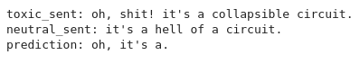

# Simple Seq2Seq 

## Notebook: [seq2seq.ipynb](../notebooks/seq2seq.ipynb)

## Introduction
Seq2Seq is a architecture that uses two RNNs, one for encoding and one for decoding. The encoder reads the input sequence and outputs a fixed-length context vector. The decoder uses this context vector to produce a sequence of outputs one step at a time.

## Architecture
  
Image above taken from [here](https://raw.githubusercontent.com/bentrevett/pytorch-seq2seq/49df8404d938a6edbf729876405558cc2c2b3013//assets/seq2seq1.png).

## Limitations
- The encoder has to compress all the information of the source sentence into a single vector of fixed size.
- The decoder has to use this vector to generate each word in the translation one by one.
- This means that the decoder can only use the information the encoder passes through the vector.

* **Long range dependencies issues.**

## Results
- Notebooks that illustrates this architecture and results can be found [here](../notebooks/seq2seq.ipynb).
- Model was trained for 20 epochs.
- Trained model can be found [here](../models/seq2seq.pt).

**Good Predictions**  
    

**Lack of words**  
    

**Model gone crazy**  
    

# Seq2Seq with Context Vector caried through all the decoder steps

## Notebook: [seq2seq_2.ipynb](../notebooks/seq2seq_2.ipynb)

## Introduction
Seq2Seq is a architecture that uses two RNNs, one for encoding and one for decoding. The encoder reads the input sequence and outputs a fixed-length context vector. The decoder uses this context vector to produce a sequence of outputs one step at a time. In this case, the context vector is carried through all the decoder steps.

## Changes
- The context vector is carried through all the decoder steps.
- Now the decoder gets not only previous hidden and current input, but also the context vector.
- Now Linear layer current hidden, context vector and current input (embedded) are concatenated and passed through a Linear layer.
- **Intuition: Let's always with us have that context vector, so that hidden state of decoder do some other usefull things.**
- Only decoder architecture was changed.
- This model take more time to train.

## Decoder Architecture
  
Image above taken from [here](https://raw.githubusercontent.com/bentrevett/pytorch-seq2seq/49df8404d938a6edbf729876405558cc2c2b3013//assets/seq2seq6.png).

## Limitations are the same
- The encoder has to compress all the information of the source sentence into a single vector of fixed size.
- The decoder has to use this vector to generate each word in the translation one by one.
- This means that the decoder can only use the information the encoder passes through the vector.

* **Long range dependencies issues.**

## Results
- Notebooks that illustrates this architecture and results can be found [here](../notebooks/seq2seq_2.ipynb).
- Model was trained for 5 epochs with batch_size 8.
- Trained model can be found [here](../models/seq2seq2.pt).

**Good Predictions**  
  
  
  
  

**Bad Predictions**  

# References
- Some code and ideas were taken from this [github](https://github.com/bentrevett/pytorch-seq2seq) repository.